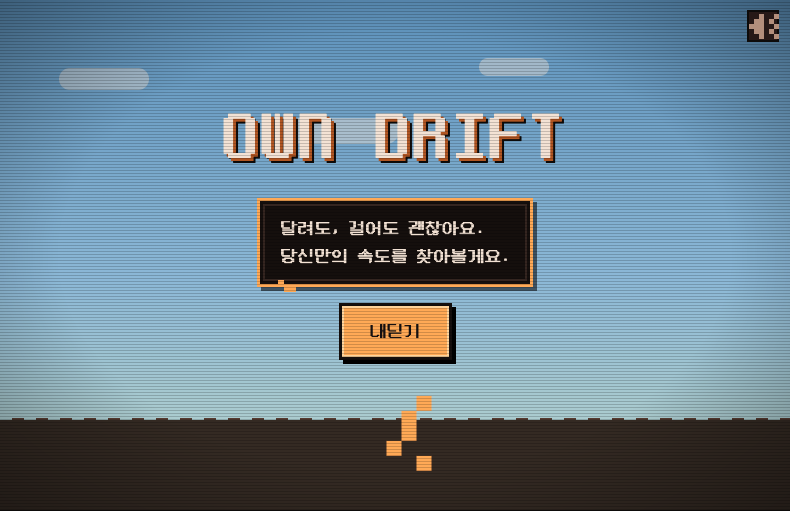
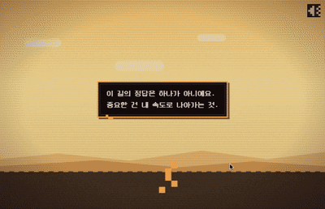

<div align="center">

# Own Drift

**빠르게 도착하는 게임이 아니라, 자기만의 속도를 찾고 그 리듬을 지켜내는 감성 웹 게임.**

[](https://own-drift.vercel.app)
[](https://github.com/jiwon0995/own-drift)
[](https://nextjs.org)
[](https://www.typescriptlang.org)

<br />

<!-- 목업 이미지 영역 — 실제 스크린샷으로 교체 -->


> *"달리지 않아도 괜찮아요. 먼저, 당신의 속도를 들어볼게요."*

</div>

---

## 왜 이 게임인가

살다 보면 남들 속도에 맞춰야 할 것 같고, 나만 뒤처진 것 같은 압박을 느끼지만 — 속도도 시간도 상대적이기에, 중요한 건 결국 '내 속도'를 찾아가는 일입니다.

이 생각을 게임으로 옮겼습니다.

**빠르게 도착하는 게임이 아닙니다.** 외부의 속도에 흔들리던 플레이어가 자신만의 리듬을 찾고, 잃어버렸을 때 다시 돌아오는 경험입니다. 세 번의 흔들림(혼란 → 인식 → 체화)을 지나 "당신의 속도를 찾았습니다"에 도달하는 것이 이 게임의 전부입니다.

---

## 게임플레이

<!-- 목업 GIF 영역 — 실제 게임플레이 GIF로 교체 -->


### 조작

| 입력 | 동작 |
|---|---|
| `Spacebar` 홀드 | 가속 (관성 있음) |
| `Spacebar` 릴리스 | 감속 (관성 있음) |
| 모바일 | 화면 길게 누르기 / 떼기 |

단일 키 홀드 방식을 선택한 이유: 두 키 조합보다 직관적이고, 모바일 탭/홀드로 자연스럽게 이식됩니다.

### 핵심 흐름

```
조작 익히기 (Tutorial)
   → 내 속도 찾기 (Find Pace) — "머무는 중…" 게이지가 차오르면 확정
   → 평온한 주행 (Main Play)
   → 다른 존재 등장 → 견뎌내고 안정 게이지를 채우면 = 1번째 찾음  [혼란]
   → 평온한 주행
   → 다른 존재 등장 → 2번째 찾음                                   [인식]
   → 평온한 주행
   → 다른 존재 등장 → 3번째 찾음                                   [체화]
   → "당신의 속도를 찾았습니다"
   → 당신의 풍경 — canvas 캡처 이미지 선물
   → 계속 달리거나 / 처음부터 내딛기

```

### 이 게임의 규칙

- **실패가 없습니다.** 자기 속도를 찾는 데 실패란 없습니다. 늦어도, 헤매도 계속 가면 됩니다.
- **경쟁이 없습니다.** 순위, 리더보드, 다른 존재의 이름이나 속도 표시 — 없습니다.
- **도착이 목표가 아닙니다.** 클리어는 도착이 아니라 인정입니다.

---

## 화면 구성

| 화면 | 설명 |
|---|---|
| **Title** | 게임 진입 + 오디오 언락 |
| **Tutorial** | Spacebar 홀드/릴리스 감각 학습 |
| **Find Pace** | 편안한 속도를 직접 찾아 확정 |
| **Main Play** | 평온한 구간 → 다른 존재 등장 반복 |
| **Return 1·2·3** | 혼란 → 인식 → 체화, 세 번의 인정 |
| **Clear** | "당신의 속도를 찾았습니다" |
| **Landscape Ending** | "당신의 풍경" — canvas 캡처 이미지 저장 |

---

## 디자인 결정

### 피드백은 텍스트가 아니라 감각으로

어떤 속도가 "내 속도"인지 게임이 알려주지 않습니다. 배경 선명도, 색온도, 발소리, 음악 그루브가 **같은 리듬으로 맞물리는 '찰칵'** 을 통해 플레이어가 직접 느끼도록 설계했습니다.

특정 속도를 정답처럼 빛내는 *유도 신호*는 쓰지 않고, "지금 잘 머물고 있음"을 비추는 *확인 신호*만 씁니다. 사람마다 다른 속도에 안착하면서도 "내가 찾았다"는 체감이 살아있도록.

### 안착 방식: 평균 통보 → 능동적 확정

처음에는 플레이어가 달린 평균 속도를 계산해 통보하는 방식을 구상했습니다. 하지만 "내가 고른 게 아니라 주어진 속도"라는 느낌이 남습니다. 그래서 **직접 한 속도에 안정되게 머물면 '머무는 중…' 게이지가 차오르고, 그 속도를 확정하는** 흐름으로 변경했습니다. 내가 선택했다는 체감이 핵심입니다.

### 레이아웃: 양옆 배너 = 외부 압박의 구현

2000년대 초반 웹게임 포털의 3단 레이아웃을 채택했습니다.

---

## 기술 스택 & 구조

```
Next.js 15 (App Router)  ·  TypeScript 5  ·  Tailwind CSS  ·  Turbopack
Vercel 배포
```

```
own-drift/
├── app/
│   ├── layout.tsx
│   └── page.tsx
├── components/
│   ├── game/          # PixelRunner, OtherPresence, Background, ...
│   ├── hud/           # StabilityGauge, SideBanner, SpeechBubble
│   └── screens/       # Title, Tutorial, FindPace, MainPlay, Clear, Ending
├── hooks/
│   └── useGameLoop.ts # rAF 기반 루프 — 고빈도 상태는 ref, UI는 스로틀 스냅샷
├── lib/
│   └── game/
│       ├── engine.ts     # 속도·구간·게이지 연산
│       ├── constants.ts  # 튜닝 파라미터
│       └── types.ts      # GameState, Phase, SpeedState
└── public/
    └── fonts/            # DungGeunMo (self-host), Press Start 2P
```

### 게임 루프 설계

고빈도로 바뀌는 게임 상태(속도, 관성, 게이지)를 React 리렌더 없이 `useRef`로 관리하고, UI 업데이트는 스로틀된 스냅샷으로 분리했습니다. 픽셀아트 렌더링은 `image-rendering: pixelated` CSS 단일 속성으로 처리합니다.

---

## 설치 및 실행

```bash
git clone https://github.com/jiwon0995/own-drift.git
cd own-drift
npm install
npm run dev
```

브라우저에서 `http://localhost:3000` 접속.

> **주의:** Spacebar 조작을 위해 데스크톱 환경을 권장합니다.

---

## 개발 일지

기획 의도, 매일의 결정과 트레이드오프를 [devlog](./docs/04-devlog.md)에 기록했습니다.

---

## 스코프 결정

**의도적으로 제외한 것들:**

| 항목 | 이유 |
|---|---|
| 실패·게임오버 | 테마상 의도적으로 없앰 — "자기 속도를 찾는 데 실패란 없다" |
| 리더보드·순위 | 경쟁 개념이 핵심 메시지와 정면 충돌 |

---

## 완성 기준

> 처음 보는 사람이 설명 없이 — **따라잡는 게 아니라 내 속도로 돌아가는 것**임을 감각으로 깨닫고, 세 번 내 속도를 찾아 "당신의 속도를 찾았다"에 도달할 수 있다. 그 과정에서 한 번도 "실패했다"는 좌절을 느끼지 않는다.

---

<div align="center">

**이 게임엔 피니시가 없습니다.**<br />
계속 달려도 되고, 여기서 멈춰도 괜찮아요.

<br />

*2026.06.09 – 06.14*

</div>
